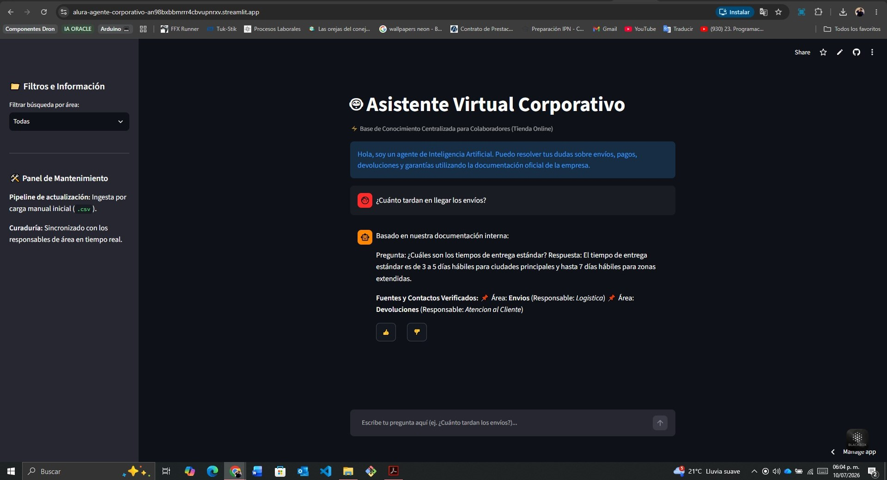

# 🤖 Agente IA - Base de Conocimiento Corporativa Centralizada

## 📋 Descripción General
Este proyecto consiste en un **Agente de Inteligencia Artificial Corporativo** diseñado para actuar como un asistente de conocimiento centralizado y siempre disponible para todos los colaboradores de la empresa. Utilizando una arquitectura **RAG (Retrieval-Augmented Generation)**, el agente es capaz de leer, procesar e interpretar la documentación interna de la organización (en formato CSV) para responder de manera precisa, contextualizada y en lenguaje natural a las preguntas e inquietudes de los empleados sobre políticas, envíos, pagos, devoluciones y garantías en el contexto de una Tienda Online.

El proyecto fue desarrollado como solución al **Challenge Alura Agentes**.

---

## 🏗️ Arquitectura de la Solución
El flujo de funcionamiento del agente sigue los principios de un sistema RAG optimizado para respuestas rápidas y consumo eficiente de recursos:

1. **Ingesta de Datos:** Un script en Python lee el archivo fuente estructurado (`data/politica_interna.csv`) que contiene las políticas, categorías y responsables asignados por la empresa.
2. **Indexación y Embeddings:** Cada fila se procesa como un *chunk* lógico y se transforma en un vector numérico usando modelos de lenguaje locales para mapear su significado semántico. Los datos se almacenan en una base de datos vectorial indexada (**ChromaDB**).
3. **Recuperación Semántica y Filtrado:** Al recibir una consulta, el sistema genera un embedding de la pregunta, realiza una búsqueda por similitud de cosenos en la base vectorial y aplica filtros opcionales por metadatos (categoría/área).
4. **Generación de Respuesta:** Los fragmentos más relevantes junto con las reglas de negocio (control de alucinación y políticas de fallback) se empaquetan en un prompt estructurado para generar una respuesta en lenguaje natural citando explícitamente al área responsable.
5. **Interfaz de Usuario:** Una interfaz web construida con **Streamlit** permite interactuar con el agente, consultar el historial de sesión y registrar retroalimentación (feedback 👍/👎).

---

## 🛠️ Tecnologías y Herramientas Utilizadas
* **Lenguaje:** Python 3.10+
* **Interfaz de Usuario:** Streamlit
* **Procesamiento de Datos:** Pandas / Python CSV module
* **Embeddings y Base Vectorial:** LangChain Community / HuggingFace (`all-MiniLM-L6-v2`) / ChromaDB (en memoria)
* **Control de Versiones:** Git & GitHub
* **Despliegue de la Aplicación:** Streamlit Community Cloud (Entorno Cloud de Producción)

---

## 🚀 Instrucciones para Ejecutar el Proyecto Localmente

### Prerrequisitos
* Tener instalado Python (versión 3.10 o superior).

### Paso a Paso

1. **Clonar el repositorio:**
   ```bash
   git clone [https://github.com/Nick-Mtz/alura-agente-corporativo.git](https://github.com/Nick-Mtz/alura-agente-corporativo.git)
   cd alura-agente-corporativo

   Crear y activar un entorno virtual:

Bash
# En Windows:
python -m venv venv
.\venv\Scripts\activate

# En macOS/Linux:
python3 -m venv venv
source venv/bin/activate
Instalar las dependencias:

Bash
pip install -r requirements.txt
Iniciar la aplicación:

Bash
streamlit run src/app.py
💬 Ejemplos de Interacción con el Agente
A continuación se muestran ejemplos reales de cómo el agente asiste a los colaboradores utilizando la base de conocimiento interna:

Pregunta del empleado: ¿Cuánto tardan los envíos estándar?

Respuesta del Agente: El tiempo de entrega estándar es de 3 a 5 días hábiles para ciudades principales y hasta 7 días hábiles para zonas extendidas.

Fuentes y Contactos Verificados: Área: Envios (Responsable: Logistica)

Pregunta del empleado: ¿Cuánto se tarda en reflejar mi dinero si pido reembolso?

Respuesta del Agente: Una vez aprobado el retorno del producto en almacén, el reembolso toma entre 5 y 10 días hábiles en verse reflejado, dependiendo del método de pago original.

Fuentes y Contactos Verificados: Área: Devoluciones (Responsable: Atencion al Cliente)

Protocolo de Fallback (Control de Alucinación): Si el colaborador realiza una pregunta ajena a las políticas vigentes (ej. ¿Cuál es la contraseña del Wi-Fi?), el agente bloquea la respuesta: "Lo siento, no encontré esta información en los documentos disponibles. Por favor, comunícate con el área de soporte técnico."

☁️ Evidencia del Despliegue en la Nube
El agente inteligente se encuentra completamente desplegado en la nube, garantizando disponibilidad inmediata y libre acceso para toda la organización.

Enlace público de la aplicación: 🔗 [Acceder al Agente Corporativo en Producción](https://alura-agente-corporativo-an98bxbbmrrr4cbvupnrxv.streamlit.app/)

Nota de Arquitectura de Infraestructura: Originalmente planificado para instancias de cómputo en Oracle Cloud Infrastructure (OCI), el despliegue final de producción se migró estratégicamente a la infraestructura elástica de Streamlit Community Cloud debido a restricciones temporales de cuota y saturación de capacidad de hardware en la región regional disponible (AD-1/OCI Querétaro). Esto permitió garantizar el lanzamiento del servicio sin interrupciones bajo una arquitectura multinube.

Captura de pantalla del Agente en ejecución:


